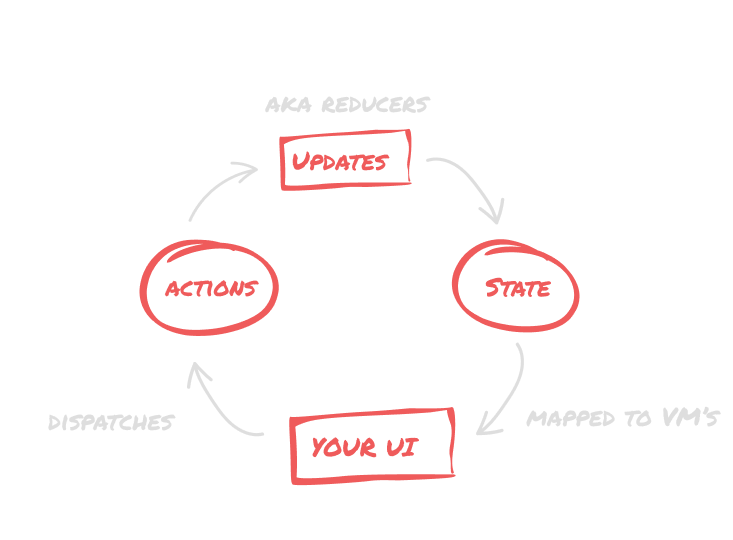
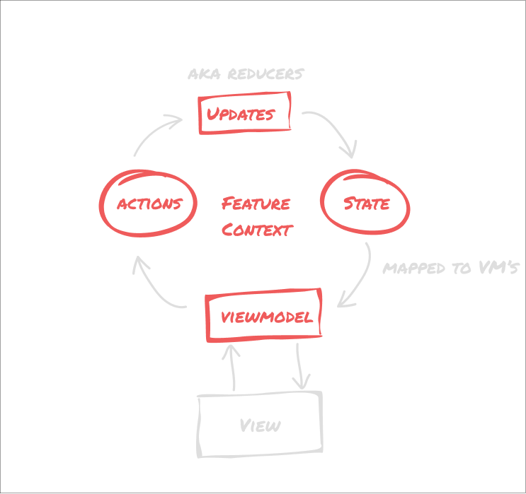

# Redukks

This library is in alpha.
The API is mostly complete and will not be changing, but there is still work to be done to make it production ready on all platforms.
For JVM and multiplatform, the library is ready for production use, but for iOS, JS and native it still isn't completely set up.
If you want to help, feel free to open an issue or a PR.

[](https://search.maven.org/artifact/com.ianrumac.redukks/redukks)
[](https://github.com/ianrumac/redukks)
[](https://kotlinlang.org)


### A simple, type-safe, and testable redux/uniflow architecture implementation for Kotlin Multiplatform

Redukks is a set of simple type-safe abstractions needed to implement uniflow and Redux-like architecture on Kotlin Multiplatform.
It simplifies the creation of stores, reducers and actions, and provides a simple way to test them.


### Why Redukks?

While there are many uniflow or redux implementations for Kotlin/Kotlin Multiplatform, most of them are either too complex, or too
simple. Either the naming is too "reduxy", they force you into one way of doing things or the abstractions are
too complex to be written on the regular. And while there are architectures that conform to this style, the naming they use is quite specific for Android and confusing to non-android developers,
making it harder to reason about or discuss with other developers.

Since I've found myself re-using the same set of abstractions through the years, I've decided to make them into a library I can both re-use and share.

The goal is to provide simple, type-safe, and testable abstractions for redux-like architecture,
while still not tying you completely to a single pattern, providing you with abstractions that can help you build your
own solution. While most libraries try to push for a full-on redux pattern, reducers can be an overhead
for some simple cases, and you should be able to avoid them if you want to - that's why Redukks doesn't *enforce* the Redux pattern itself.

For more reasoning on why uniflow and why redux, you can check out the talk [(de)constructing architecture](https://speakerdeck.com/ianrumac/de-constructing-architecture).

### What problems can it help me solve?


* **State Management**: Redukks provides a simple way to manage your state, update it in a predictable way and listen to changes. You can use
  it to manage the state of your whole app, a single feature, have a shared state between different features (screens) or have multiple states for one screen.
  


* **Action handling**: Redukks provides a simple way to handle actions, and execute them in a predictable way. You can use it to handle
  actions from the UI, network calls, or any other work you might need. The unopinionated nature of the library allows you to implement your own
action handlers specific to your usecase - even letting you break the uniflow pattern by implementing backwards signalling.


* **Testing**: With Redukks, testing your state, reducers and actions is incredibly simple - both due to the nature of the API and the extra compile safety. You can easily test your state management logic,
  or your action handling logic without the need for complex testing API's. 


## How uniflow/redux works?

The uniflow architecture is based on one simple idea - your app is a constant cycle of data that flows in one direction.
The state and it's changes are driven by the UI, and the UI is driven by the state. This allows you to have a single source of truth
and provides you with a simple way to think and reason about your app.

Meanwhile, Redux is a pattern that helps you manage your state. It's based on the idea that your state is a single source of truth,
and that it should be updated in a predictable manner.

Redukks is a combination of these two ideas - it provides you the basic abstractions to implement
uniflow and Redux-based architectures but doesn't force you into a single way of doing things.




The flow itself is quite simple - you have a state X and you have N ways to change it.
Those ways to change it are called "reducers" and they are the only way to change that state.
So instead of wildly updating it from wherever we please, we define a set of "Updates" that can be used to update the state.

But, since most applications are more complex than a simple counter, you need a way to handle complex work too.
That's where actions come in. You "dispatch" an action and it executes some work, and during that execution, it can update the state via reducers or invoke other actions.

This makes it easy to define and test all the possible permutations of state changes, and makes it easy to reason about the state of your app and be confident it works how you intended.


## Quickstart

1. Add the dependency to your project

Gradle Groovy:

```groovy
dependencies {
    implementation 'com.ianrumac.redukks:redukks:0.1.4'
}
```

Gradle Kotlin:

```kotlin
    implementation("com.ianrumac.redukks:redukks:0.1.4")
```

2. Define a state type and it's updates

```kotlin
data class CountState(val total: Int)

sealed class Updates(override val reduce: (CountState) -> CountState) : Reducer<CountState> {
    class Add(val number: Int) : Updates({
        state.copy(state.total + number)
    })
    class Subtract(val number: Int) : Updates({
        state.copy(state.total - number)
    })
}
```

3. Create a `FeatureContext` class that contains all the dependencies for your feature (or for your actions).

```kotlin
interface CountContext {
    val client: CountingAPI
    val store: Store<CountState>
}
```

4. Define `Actions` that can be executed on the context

```kotlin
sealed class Actions(override val execute: suspend CountContext.() -> Unit) : TypedAction<CountContext> {
    class AddToClient(val number: Int) : Actions({
        //here, we have access to all the CountContext properties that are captured during execution
        //For example, we can access the store and update it with the result of the network call.
        val result = client.add(number)
        state.update(Updates.Add(result))
    })

    class SubtractFromClient(val number: Int) : Actions({
        val result = client.subtract(number)
        state.update(Updates.Subtract(result))
    })
}
```

5. Execute actions on the context

```kotlin

data class CountWithAnAPI(val scope: CoroutineScope) : CountContext {
    override val client = CountingAPI()
    override val store = reducedStore(CountState(0))
    override val handler =
        actionHandlerFor(scope, this) //this is a coroutine scope that will be used to execute the actions
}

val context = CountWithAnAPI(scope)

//In a class that implements Dispatcher<Actions>
//This is actually a call to context.handler.dispatch(Actions.Add(1))
dispatch(Actions.Add(1))
```

6. To make it easier to read, you can define it all under a context interface:

```kotlin
interface CountContext {
  val client: CountingAPI
  val store: Store<CountState>
  val handler: ActionDispatcher<Actions>


  data class CountState(val total: Int)
  sealed class Updates(override val reduce: (CountState) -> CountState) : Reducer<CountState> {
      class Add(val number: Int) : Updates({
          state.copy(state.total + number)
      })
      class Subtract(val number: Int) : Updates({
          state.copy(state.total - number)
      })
  }


  sealed class Actions(override val execute: suspend CountContext.() -> Unit) : TypedAction<CountContext> {
      class AddToClient(val number: Int) : Actions({
          //here, we have access to all the CountContext properties that are captured during execution
          //For example, we can access the store and update it with the result of the network call.
          val result = client.add(number)
          state.update(Updates.Add(result))
      })

      class SubtractFromClient(val number: Int) : Actions({
          val result = client.subtract(number)
          state.update(Updates.Subtract(result))
      })
  }
}
```

7. Now, you can use the context to execute actions, and listen to state changes:

```kotlin
val context = CountWithAnAPI(scope)
val handler = context.handler
handler.dispatch(Actions.AddToClient(1))
context.store.listen().collectLatest { state ->
    //do something with the state
}
```

## For Android developers

You can easily use Redukks with Android's ViewModel and it fits great with Jetpack Compose (and the View framework too!).
Simply collect the store as a StateFlow or use it with LiveData. Your ViewModel can also implement `Dispatcher<Actions>` so you can dispatch the actions upstream (delegate them to the action handler).
You can also create abstractions for this such as a `ReduxViewModel` that handle these things for you.

Using it with a viewmodel is simple:

```kotlin
@HiltViewModel
class CountViewModel @Inject constructor(
    val actionHandler: Dispatcher<CountContext.Actions>,
    val store: Store<CountContext.State>
) : ViewModel(), Dispatcher<Actions> by actionHandler {
    //Note: Not a real implementation, be careful where you collect and map your state
    val state = store.listen().map(this::mapToViewModel)
        .stateIn(viewModelScope, SharingStarted.WhileSubscribed(), initialValue = CountVM(0))

    fun mapToViewModel(it: CountContext.State): CountVM {
        ...
    }
}
```

And now in your UI you can simply do:

```kotlin 
 val vm : CountViewModel by viewModels()
  ...
 vm.dispatch(Actions.AddToClient(1))
```

You can also control the lifecycle of your state by hoisting it up or down in the lifecycle scope tree.
For example, if you need to share a state store, you can just move it up from i.e. a fragment scope to an activity scope
and pass it downwards to the fragments. This way, you can share the state between fragments, but still have
only a single state store. You can even provide multiple stores for an action, or provide multiple stores to your UI to combine.

```kotlin
typealias CountStore = Store<CountState>
typealias UserStore = Store<UserState>

interface CountContext {
    val countStore: CountStore
    val userStore: UserStore
}

class AuthenticatedCounterContext(userStore: UserStore) {
    override val userStore = userStore
    override val countStore = CountStore(CountState(0))
}

//...
class AddForUser : Actions({
    val count = countStore.state.total
    countStore.update(Updates.Add(1))
    userStore.update(UpdateStateForUser(countStore.total))
})

```

This works beautifully with Jetpack Compose, since you can easily derive the UI from the state (please, map it
to a viewmodel class before doing so, don't mix your core models and your UI models).



## General Usage

Since Redukks is a modular set of abstractions, you can use only the parts you need for the complexity level you want.
Redukks provides a few default implementations of the abstractions, but you can easily create your own.

Let's start with the simplest case, a simple store.
We'll start with a simple counter implementation, with only a store without reducers or actions.
In general, if you prefer not to write reducers, you can use the `BasicStore` class, which is a simple store exposing
an `update` function with a closure that takes in the current state and returns a new state.
```kotlin

data class CountState(val total: Int)

val store = BasicStore(CountState(0))

store.update {
    it.copy(it.total + 1)
}

println(store.state.total) //prints 1

store.listen().collectLatest { state ->
    //do something with the state
}
```

Now, we can also use a reducer to define state updates in a typesafe way.
So let's create a reducer. Reducers are just objects that implement the `Reducer<StateType>` interface,
meaning they have a `reduce` closure that takes in the current state and returns a new state.
It's like writing

```kotlin
fun addNumber(state: CountState, number: Int) : CountState {
    return state.copy(state.total + number)
}
```

but with a bit more type safety, so that you can be certain all possible state changes are predefined and tested.

```kotlin
sealed class Updates(override val reduce: (CountState) -> CountState) : Reducer<CountState> {
    class Add(val number: Int) : Updates({
        state.copy(state.total + number)
    })
    class Subtract(val number: Int) : Updates({
        state.copy(state.total - number)
    })
}
```

Now, to use this reducer, we need to create a `ReducedStore<StateType, ReducerType>`. This is a store that can only be
updated
via the defined reducer type. A default implementation is provided as BasicReducedStore, but you can easily create your
own.

```kotlin
val basicStore = BasicStore(CountState(0))
// you can either provide it with a store or the initial state to use a BasicStore
val store = BasicReducedStore<CountState, Updates>(basicStore)

//or use the helper function
val store = createReducedStore<CountState,Updates>(CountState(0))

store.update(Updates.Add(1))
store.listen().collectLatest { state ->
    //do something with the state
}
```

## Actions

Actions are asynchronous pieces of code that can be executed.
Usually they are used to perform side effects, like network calls, or to dispatch other actions and updates.
For example, fetching a list of items from a server, and then dispatching an action to update the state with the result.

Actions are a bit more complicated, since they usually need to be able to access dependencies.
To do this, we provide a `<Context>` that contains all the dependencies, and then create actions that
are executed with context as a receiver, meaning they have access to it as `this`.
With this, we can dispatch them to a `Dispatcher<ActionType>`, which should handle actions.

A basic coroutine based action handler is implemented by default under `TypedActionHandler` and
a custom one can be easily implemented by providing a `Dispatcher<ActionType>` or `AsyncDispatcher<ActionType>` for more
execution control (via Deferred<Unit>). Also, provided is a `AsyncAction` class that can be used to simply pass
the closure via constructor.

Now, let's see how to define async actions.

First, we need a context that these actions can be executed on.

While for simple cases (i.e. simply updating the store) you can just use a `Store<StateType>`, it's better to create a
custom context.
This gives you an easy way to access dependencies, mock them, replace them, etc. Also, it's a good practice to keep
the actions tightly coupled to them, so that you can easily see what actions need what dependencies.

With Kotlin's context receivers on the way, the code can be even cleaner in the future,
removing the need for actions entirely and just implementing simple functions upon the receivers. But since most
codebases don't have context receivers yet, we'll focus only on this implementation for now.

First, we define a CountContext interface that contains the dependencies we need:

```kotlin
interface CountContext {
    val client: CountingAPI
    val store: Store<CountState>
    val handler: Dispatcher<Actions>
}
```

Then, we can define Actions via sealed classes that implement `TypedAction<CountContext>`:

```kotlin
sealed class Actions(override val execute: suspend CountContext.() -> Unit) : TypedAction<CountContext> {
    class Add(val number: Int) : Actions({
        //here, we have access to all the CountContext properties that are captured during execution
        //For example, we can access the store and update it with the result of the network call.
        val result = client.add(number)
        state.update(Updates.UpdateState(result))
    })

    class Subtract(val number: Int) : Actions({
        val result = client.subtract(number)
        state.update(Updates.UpdateState(result))
    })
}
```

Now, we can implement the context and use the dispatcher to execute actions:

```kotlin
data class CountWithAnAPI(val scope: CoroutineScope) : CountContext {
    override val client = CountingAPI()
    override val store = BasicReducedStore<CountState, Updates>(CountState(0))
    override val handler = createActionHandler(scope, this)
}

//In a class that implements Dispatcher<Actions>, like a viewmodel that delegates it to the handler
//This is actually a call to context.handler.dispatch(Actions.Add(1))

dispatch(Actions.Add(1))
dispatch(Actions.Subtract(1))

```

## Testing

Testing is quite easy, for both reducers and actions. For reducers, you can simply create a state and a reducer,
i.e. `val state = CountState(0)` and `val reducer = Updates.Add(1)`, and then call `reducer.reduce(state)`.
Now you can assert that the result is the expected one.

```kotlin
@Test
fun `update the total count by adding 1`() {
    val state = CountState(0)
    val reducer = Updates.Add(1)
    val result = reducer.reduce(state)
    assertEquals(1, result.total)
}
```

For actions, you can create a context and a dispatcher, i.e. `val context = CountWithAnAPI(TestCoroutineScope())`
and `val action = Action.Add(1)`, and then call `action.execute(context)`.
This provides you with an easy way to test actions, since you can easily mock the context and assert that the
actions are executed as expected or use mocking libraries such as MockK to verify mocks executed properly.

```kotlin
@Test
fun `update the total count and add from client`() = runTest {
        val context = CountWithAnAPI(this)
        val action = Actions.Add(1)
        action.execute(context)
        assertEquals(1, context.store.state.total)
    }
```

## Customization

Each component is written in a way that allows for easy customization, so that you can easily create your own.
Meaning by implementing a Store or a Dispatcher, you can easily have things like an API/Socket/Room backed store,
or Actions that signal when they are done, or other Flows in your store.
Don't be afraid to customize the pattern to your needs - we're not writing code to satisfy the patterns,
we're writing it for ourselves, our teammates and our users.

## Contributing

Feel free to open an issue or a PR if you have any suggestions or improvements.
